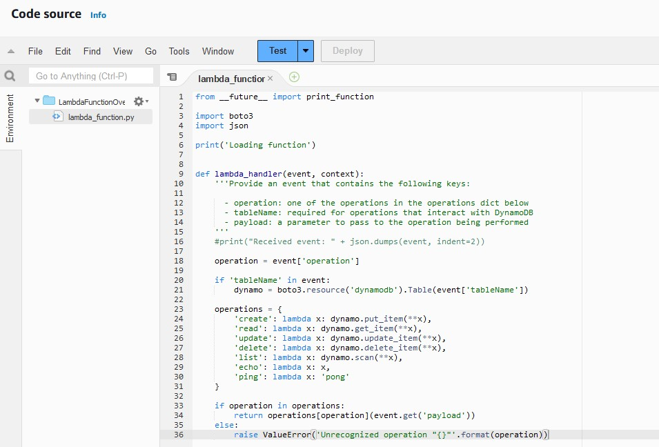
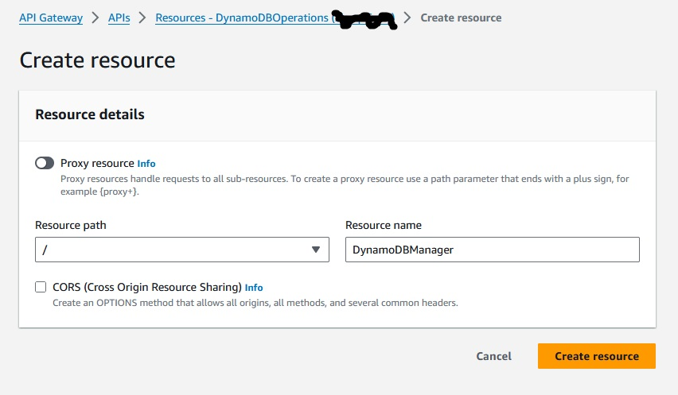
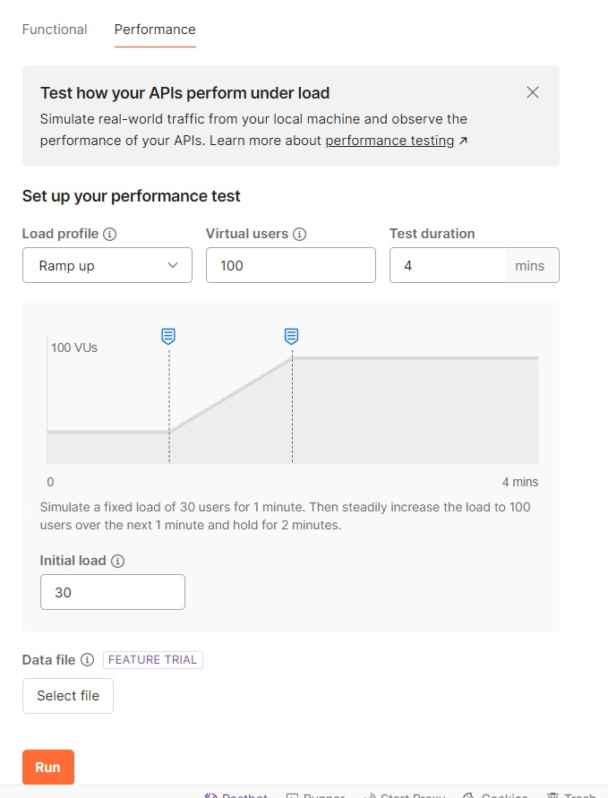
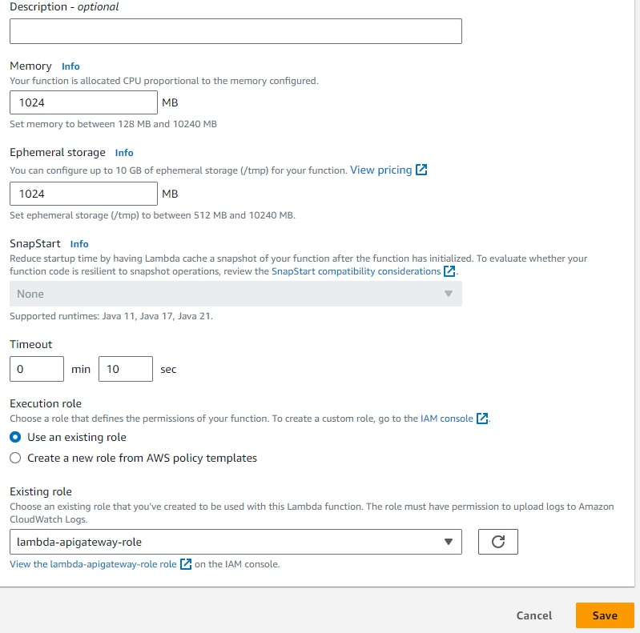
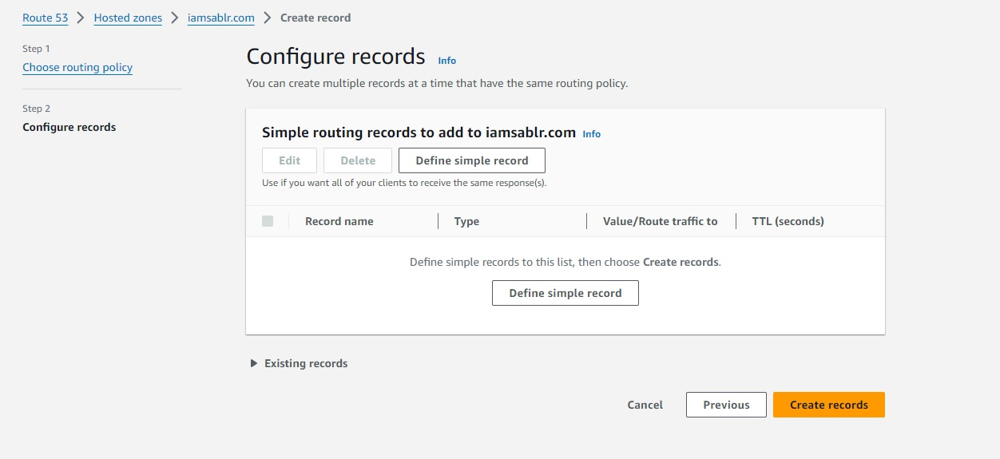

# LevelUp! Lab for Serverless

## Lab Overview And High Level Design

Let's start with the High Level Design.


An Amazon API Gateway is a collection of resources and methods. For this tutorial, you create one resource (DynamoDBManager) and define one method (POST) on it. The method is backed by a Lambda function (LambdaFunctionOverHttps). That is, when you call the API through an HTTPS endpoint, Amazon API Gateway invokes the Lambda function.

The POST method on the DynamoDBManager resource supports the following DynamoDB operations:

* Create, update, and delete an item.
* Read an item.
* Scan an item.
* Other operations (echo, ping), not related to DynamoDB, that you can use for testing.

The request payload you send in the POST request identifies the DynamoDB operation and provides necessary data. For example:

The following is a sample request payload for a DynamoDB create item operation:

```json
{
    "operation": "create",
    "tableName": "lambda-apigateway",
    "payload": {
        "Item": {
            "id": "1",
            "name": "Bob"
        }
    }
}
```
The following is a sample request payload for a DynamoDB read item operation:
```json
{
    "operation": "read",
    "tableName": "lambda-apigateway",
    "payload": {
        "Key": {
            "id": "1"
        }
    }
}
```

## Setup

### Create Lambda IAM Role 
Create the execution role that gives your function permission to access AWS resources.

To create an execution role
First Create the custom policy with permission to DynamoDB and CloudWatch Logs. If this policy is already present then create the new role. If the policy is not present then create it with the below json 
1. Open the policies page in the IAM console. Choose Create Policy. Click on the json editor. Copy paste the below json policy in the editor. This policy has permissions that the function needs to write data to DynamoDB and upload logs.
   ```json
    {
    "Version": "2012-10-17",
    "Statement": [
    {
      "Sid": "Stmt1428341300017",
      "Action": [
        "dynamodb:DeleteItem",
        "dynamodb:GetItem",
        "dynamodb:PutItem",
        "dynamodb:Query",
        "dynamodb:Scan",
        "dynamodb:UpdateItem"
      ],
      "Effect": "Allow",
      "Resource": "*"
    },
    {
      "Sid": "",
      "Resource": "*",
      "Action": [
        "logs:CreateLogGroup",
        "logs:CreateLogStream",
        "logs:PutLogEvents"
      ],
      "Effect": "Allow"
    }
    ]
    }
    ```
2. Create this policy with the name **customPolicy-dynamoDB-CloudWatch**
3. Go to the roles page in the IAM console.
4. Choose Create role.
5. Create a role with the following properties.
    * Trusted entity – Lambda.
    * Role name – **lambda-apigateway-role**.
    * Permissions – Custom policy with permission to DynamoDB and CloudWatch Logs. This custom policy **customPolicy-dynamoDB-CloudWatch** has been created in step 1 or it already exists in your account. Attach that policy here.


### Create Lambda Function

**To create the function**
1. Click "Create function" in AWS Lambda Console


2. Select "Author from scratch". Use name **LambdaFunctionOverHttps** , select **Python 3.12** as Runtime. Under Permissions, select **Use an existing role**, and select **lambda-apigateway-role** that we created, from the drop down

3. Click "Create function"


4. Replace the boilerplate coding with the following code snippet and click "Save"

**Example Python Code**
```python
from __future__ import print_function

import boto3
import json

print('Loading function')


def lambda_handler(event, context):
    '''Provide an event that contains the following keys:

      - operation: one of the operations in the operations dict below
      - tableName: required for operations that interact with DynamoDB
      - payload: a parameter to pass to the operation being performed
    '''
    #print("Received event: " + json.dumps(event, indent=2))

    operation = event['operation']

    if 'tableName' in event:
        dynamo = boto3.resource('dynamodb').Table(event['tableName'])

    operations = {
        'create': lambda x: dynamo.put_item(**x),
        'read': lambda x: dynamo.get_item(**x),
        'update': lambda x: dynamo.update_item(**x),
        'delete': lambda x: dynamo.delete_item(**x),
        'list': lambda x: dynamo.scan(**x),
        'echo': lambda x: x,
        'ping': lambda x: 'pong'
    }

    if operation in operations:
        return operations[operation](event.get('payload'))
    else:
        raise ValueError('Unrecognized operation "{}"'.format(operation))
```


### Test Lambda Function

Let's test our newly created function. We haven't created DynamoDB and the API yet, so we'll do a sample echo operation. The function should output whatever input we pass.
1. Click the arrow on "Select a test event" and click "Configure test events"

2. Paste the following JSON into the event. The field "operation" dictates what the lambda function will perform. In this case, it'd simply return the payload from input event as output. Click "Save" to save
```json
{
    "operation": "echo",
    "payload": {
        "somekey1": "TestValue1",
        "somekey2": "TestValue2"
    }
}
```


3. Click "Test", and it will execute the test event. You should see the output in the console


We're all set to create DynamoDB table and an API using our lambda as backend!

### Create DynamoDB Table

Create the DynamoDB table that the Lambda function uses.

**To create a DynamoDB table**

1. Open the DynamoDB console.
2. Choose Create table.
3. Create a table with the following settings.
   * Table name – lambda-apigateway
   * Primary key – id (string)
4. Choose Create.


### Create API

**To create the API**
1. Go to API Gateway console
2. Click on the three lines on the extreme left side of the webpage to expand the menu. Then click on APIs.
3. Scroll down to REST API. Select "Build" 

 

4. Give the API name as **DynamoDBOperations**, keep everything as is, click "Create API"


Now the page changes to the API GW API resource view for this newly created API.


5. Each API is collection of resources and methods that are integrated with backend HTTP endpoints, Lambda functions, or other AWS services. Typically, API resources are organized in a resource tree according to the application logic. At this time you only have the root resource, but let's add a resource next. 

Click "Create Resource" in the middle pane under "Resources" heading. A resource detail entry page opens up. 

6. Input "DynamoDBManager" in the Resource Name, Resource Path will get populated. Click "Create Resource"



7. Let's create a POST Method for our API. With the "/dynamodbmanager" resource selected, Click "Create Method" button in the right side below pane of the page labeled "Methods". 


8. Select "POST" from drop down menu , then choose the lamdba function name in the search bar. Search for the lambda create "LambdaFunctionOverHttps". Select it. Leave everything as is and select "Create Method".
The screen will refresh and below screen will be shown. This new screen has the integration directly with Lambda.

Click on the Lambda icon. A popup shows the name of the lambda function which is integrated. 


Our API-Lambda integration is done!

### Deploy the API

In this step, you deploy the API that you created to a stage called prod.

1. Click the "Deploy API" button on the top right corner of the screen. A pop-up comes up.

2. Now it is going to ask you about a stage. Select "[New Stage]" for "Deployment stage". Give "Prod" as "Stage name". Click "Deploy"

    

   Now the screen refreshes and the staging screen is shown.

    

3. We're all set to run our solution! To invoke our API endpoint, we need the endpoint url. In the "Stages" screen, expand the stage "Prod", select "POST" method, and copy the "Invoke URL" from screen


### Running our solution

1. The Lambda function supports using the create operation to create an item in your DynamoDB table. To request this operation, use the following JSON:

```json
{
    "operation": "create",
    "tableName": "lambda-apigateway",
    "payload": {
        "Item": {
            "id": "FirstNumberInserted",
            "number": 25
        }
    }
}
```
2. To execute our API from local machine, we are going to use Postman and Curl command. You can choose either method based on your convenience and familiarity. 
    * To run this from Postman, select "POST" , paste the API invoke url. Then under "Body" select "raw" and paste the above JSON. Click "Send". API should execute and return "HTTPStatusCode" 200.

    

    * To run this from terminal using Curl, run the below
    ```
    $ curl -X POST -d "{\"operation\":\"create\",\"tableName\":\"lambda-apigateway\",\"payload\":{\"Item\":{\"id\":\"1\",\"name\":\"Bob\"}}}" https://$API.execute-api.$REGION.amazonaws.com/prod/DynamoDBManager
    ```   
3. To validate that the item is indeed inserted into DynamoDB table, go to Dynamo console, select "lambda-apigateway" table, select "Items" tab, and the newly inserted item should be displayed.


4. Run the step 1 of inserting records into DynamoDB table a few times each time modifying the **id** value and the **number** value in the above json.

```json
{
    "operation": "create",
    "tableName": "lambda-apigateway",
    "payload": {
        "Item": {
            "id": "<NewValue>",
            "number": <NewValue>
        }
    }
}
```

4. Now post running the record 5/6 times, to get all the inserted items from the table, we can use the "list" operation of Lambda using the same API. Pass the following JSON to the API, and it will return all the items from the Dynamo table

```json
{
    "operation": "list",
    "tableName": "lambda-apigateway",
    "payload": {
    }
}
```


We have successfully created a serverless API using API Gateway, Lambda, and DynamoDB!

## Performance testing the API using Postman
The performance testing of API can be very easily done through Postman. The steps to do that are listed below.

### Setup for Creating Collection and POST Request
1. Create a blank collection in Postman. Rename that to **ServerlessMicroServicePerformanceTesting**. The screen of Postman will look like this now.
   
   
   
2. Now click on the three dots right adjacent to the named collection **ServerlessMicroServicePerformanceTesting**. A dropdown comes. Select **New Request**. 

   

   This will create a new request. The Page will look like this now.

   
   
3. Now in this new request section, select the dropdown and choose **POST**. Paste the invoke URL from the POST method used above to list the records. Also add the list operation JSON in the body in raw format.
   
   ```json
   {
    "operation": "list",
    "tableName": "lambda-apigateway",
    "payload": {
    }
   }
   ```
  Save this request by clicking save.

### Running Performance Test

Setup the performance test on the API GW using PostMan. 
1. Select the **ServerlessMicroServicePerformanceTesting** Collection in Postman.
2. Click **Run** button on the extreme right side of the page. This will open up the runner setup page.

   
   
4. Now select the **Performance** tab. Update Load Profile to **Ramp up**, Virtual User to **100**, Test Duration to **4** and initial Load to **30**.

   

   Now click **Run** to run the instance. 

   

5. Now before re-running the second round of performance testing, I am going to add more memory and timeout to lambda function in an effort to reduce the average response time.
   Go to lambda in the AWS Console. Select your lambda function **LambdaFunctionOverHttps**. Now click Configuration tab. Click **Edit** on the **General Configuration** tab.
   Modify Memory to **1024**, Ephemeral Storage to **1024** and Timeout to **10** seconds.

   

6. Now go to Postman and under the performance tab, click "Run Again" to re-run the performance test. It will again go back to the setup. Update Load Profile to **Ramp up**, Virtual User to **100**, Test Duration to **4** and initial Load to **30**. Now Click **Run** to run the test again. 
   
   

   Post our running the second round of performance test, the average response time of the API GW has reduced by nearly 40% meaning the system is able to successfully handle traffic and has reduced latency.  
   
## Creating a Custom Domain Name

Now when we are triggering the API GW, we use the invoke URL for a particular method and that is a specific AWS syntax containing 
```[<API_ID>.execute-api.<AWS-REGION>.amazonaws.com/<stageName>/<ResourceName>](https://api-id.execute-api.region.amazonaws.com/stage)```.
where api-id is generated by API Gateway, region (AWS Region) is specified by you when creating the API, and stage is specified by you when deploying the API.

Each time we want to trigger the API GW, using that invoke URL is very difficult and not easy to keep a track of it. 
Custom domain names are simpler and more intuitive URLs that you can provide to your API users. 

The hostname portion of the URL (that is, api-id.execute-api.region.amazonaws.com) refers to an API endpoint. The default API endpoint can be difficult to recall and not user-friendly.
With custom domain names, you can set up your API's hostname, and choose a base path (for example, myservice) to map the alternative URL to your API.

### Step 1 Create a custom domain name
You must have a registered internet domain name in order to set up custom domain names for your APIs. If needed, you can register an internet domain using Amazon Route 53 or using a third-party domain registrar of your choice. An API's custom domain name can be the name of a subdomain or the root domain (also known as "zone apex") of a registered internet domain.

After a custom domain name is created in API Gateway, you must create or update your DNS provider's resource record to map to your API endpoint. Without such a mapping, API requests bound for the custom domain name cannot reach API Gateway.

I have created an internet domain name as ```iamsablr.com``` in Route53.


Next step is to create the custom domain name in the API Gateway. Click on "Custom Domain Name" tab on the left menu. Then follow the instructions and create the domain name. 


### Step 2 Create a certificate in ACM
You will have to provide a public certificate generated by ACM (AWS Certificate Manager) and give the domain name for mapping purposes. To provide a certificate for a custom domain name in a Region where ACM is supported, you must request a certificate from ACM. To provide a certificate for a Regional custom domain name in a Region where ACM is not supported, you must import a certificate to API Gateway in that Region.


ACM makes it straightforward to set up and use a custom domain name for an API. You create a certificate for the given domain name (or import a certificate), set up the domain name in API Gateway with the ARN of the certificate provided by ACM, and map a base path under the custom domain name to a deployed stage of the API. With certificates issued by ACM, you do not have to worry about exposing any sensitive certificate details, such as the private key.


### Step 3 Map the custom domain name to the API GW

Click on the **API Mappings** tab in the custom domain names screen. Now in that section click on **Configure API Mappings**.  


Now in this screen, click on **Add New Mapping** and setup API name, Stage and the path. Click **Save** to save the record.


### Step 4 Setup an alias record in Route53 for this hosted Zone to map to the API GW.
Now the setup is done in API GW. However since we have setup the Route53, we need to add an alias record so that the API GW mapping is done to the newly created HostedZone. 

Open the Hosted Zone "iamsablr.com" and click **Create Record**. Now select the routing as per your understanding and click next at the bottom.



Click "Define simple Record" and fill it up with these record values.
Record Type --> *A - Routes Traffic to an IPv4 address and some AWS resources"
Value/Route Traffic to --> **Alias to API Gateway API**
Region --> **YOUR REGION**
Name of API --> **Auto Populated**

Click Save to save the record.

### Step 5 New Custom Domain is setup mapped to API GW 
Now this new Custom Domain is setup and it can be used to trigger the API GW and test the results. 

## Cleanup

Let's clean up the resources we have created for this lab.
### Cleaning up DynamoDB

To delete the table, from DynamoDB console, select the table "lambda-apigateway", and click "Delete table"


### Cleaning up Lambda

To delete the Lambda, from the Lambda console, select lambda "LambdaFunctionOverHttps", click "Actions", then click Delete


### Cleaning up API GW
To delete the API we created, in API gateway console, under APIs, select "DynamoDBOperations" API, click "Actions", then "Delete"


#### References
[Custom Domain](https://docs.aws.amazon.com/apigateway/latest/developerguide/how-to-custom-domains.html)
[Performance Testing in Postman](https://learning.postman.com/docs/collections/performance-testing/testing-api-performance/)
